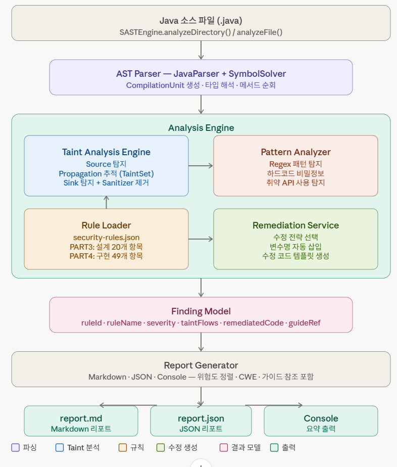

# 개발 스토리

## 목차

1. [사용한 AI](#1-사용한-AI)
2. [개발 진행 과정](#2-개발-진행-과정)
3. [개발하면서 느낀 점](#3-개발하면서-느낀-점)
4. [자주 묻는 질문 (FAQ)](#4-자주-묻는-질문-faq)

---

## 1. 사용한 AI

| AI | 사용한 요금제 |
|---|---|
| Gemini | Google AI Pro |
| Claude | Pro 플랜 |
| Claude Code | Pro 플랜 |

---

## 2. 개발 진행 과정

### 2.1 Gemini에서 Claude에 적용할 프롬프트 생성

**[요청 프롬프트]**
```text
'Java 언어로 구성된 프로젝트의 소스코드 정적 분석 도구를 바이브 코딩으로 개발' 을 본격적으로 진행해야 해.

지금까지 생각한 내용으로는 여기서 클로드에 적을 프롬프트와 계획서를 생성한 후, 클로드에서 클로드 코드에 적용한 프롬프트를 생성한 후 진행하는 거야.

이 채팅창은 고정할꺼고, 전체적인 항목은 업로드한 소프트웨어_보안약점_진단가이드(2021)의 PART3과 PART4를 참고하려고 해
```

### 2.2 Gemini가 생성한 프롬프트를 Claude에 적용

**[요청 프롬프트]**
```text
[Context] 나는 Java 소스코드 정적 분석 도구를 개발하려고 해. 업로드된 '소프트웨어_보안약점_진단가이드(2021).pdf'의 PART3(설계)과 PART4(구현) 항목을 분석 엔진의 핵심 규칙(Rule)으로 삼을 거야.

[Tech Stack Recommendation]
Java 언어로 개발하며, AST 분석을 위해 JavaParser 또는 Spoon 라이브러리를 사용할 계획이야. 어떤 것이 이 프로젝트에 더 적합할지 먼저 추천해 주고 시작해 줘.

[Instruction]
1.Java소스코드를 입력받아 AST를 생성하고 분석할 수 있는 도구의 전체 아키텍처를 설계해 줘.
2.가이드의 '입력데이터 검증 및 표현' 섹션(PART 4) 중 'SQL 삽입', '경로 조작 및 자원 삽입'을 탐지하기 위해 **Source(입력점) -> Propagator(전파) -> Sink(취약점 발생점)**를 추적하는 Taint Analysis 로직을 설명해 줘.
3.(중요) PDF에 기재된 각 보안약점별 **'진단항목명'과 '보안약점 번호'**를 추출해서 분석 규칙(Rule)을 JSON 형태로 추상화해 줘.

[Task: Remediation Module]
1.Remediation Database: PDF의 '조치방안'과 '안전한 코드 예시'를 참고하여, 탐지된 약점별 수정 템플릿을 매핑한 데이터 구조를 설계해 줘.
2.Contextual Suggestion: 단순히 일반 텍스트를 출력하는 게 아니라, 분석된 AST 노드에서 변수명(예: user_id)을 추출해 수정 코드에 자동으로 삽입하는 기능을 구상해 줘.
3.Report Output: [진단항목 번호], [약점명], [위험도], [취약한 코드 라인], [권고 수정 코드], [가이드 참조 페이지]를 포함한 리포트 포맷을 만들어 줘.

[Action] 먼저 프로젝트의 전체 구조를 제안하고, 'SQL 삽입' 항목에 대해 취약 코드를 해결 코드로 변환해주는 RemediationService 클래스의 인터페이스와 초안을 작성해 줘.
```

> **목적:** Claude에게 프로젝트의 아키텍처와 핵심 요구사항을 한 번에 주입하기 위한 컨텍스트 생성 프롬프트입니다.

**[Claude가 분석 후 이카텍처와 파일을 생성함]**



### 2.3 Claude가 생성한 파일들을 Claude Code에 적용
> Claude가 생성한 파일들을 Claude Code에 적용했습니다(파일 업로드)

```text
[Claude가 생성한 파일 구성]
java-sast-tool/
├── Security rules.json      # KISA 보안 가이드라인 기반 분석 룰셋 (JSON)
├── TaintAnalysisEngine.java # Source -> Sink 추적을 담당하는 핵심 분석 엔진
├── RemediationService.java  # 취약점 발견 시 수정 코드를 제안하는 서비스
├── ReportGenerator.java    # 분석 결과를 리포트 형식으로 변환
├── Finding.java            # 탐지된 보안 약점의 메타데이터 모델
├── SastEngine.java         # 전체 분석 프로세스를 제어하는 메인 컨트롤러
└── pom.xml                 # JavaParser 등 외부 라이브러리 의존성 관리
```


### 2.4 Claude Code에서 실제 분석 도구 구현 및 업그레이드/학습/검증 진행
```text
AWS EC2에 Claude Code 설치 후 Claude가 생성한 파일를 기초로 해서 각 단계를 진행했습니다.
- 서비스 생성/업그레이드
  1)분석 도구 엔진 개발
  2)HTML 화면 생성
  3)분석 결과 내용 고도화
  4)PDF리포트 내용 고도화
  5)KISA 보안 가이드라인 기반 분석 룰셋 고도화
- 학습 : 가지고 있는 운영/구축 프로젝트 소스를 기반으로 학습
- 검증 : 분석 결과가 정확한지 검증
```

---

## 3. 개발하면서 느낀 점

### 3.1 기획 및 설계의 절대적 중요성
* **분석시간 오래 걸림**: 'Java 소스코드 정적 분석 도구 개발'이라는 명확하면서도 난이도 높은 목표를 달성하기 위해, 아키텍처 설계와 구현 방식에 대한 심도 있는 기획 시간이 선행되었습니다.
* **AI 교차 활용을 통한 솔루션 구체화**: 
  * **Gemini**를 활용하여 초기 아이디어 스케치 및 간략 프롬프트 생성·검토를 빠르게 진행했습니다.
  * 이후 **Claude**로 컨텍스트를 이관하여 상세 기획안을 수립하고 기술 보고서를 검증하는 '크로스 플랫폼 교차 검증' 방식으로 기획의 완성도를 높였습니다.

### 3.2 효율적인 AI 컨텍스트 관리 및 단계별 분할 진행
* **컨텍스트 비대화 방지**: `Claude Code`를 통한 CLI 기반 개발 시, 대화 및 소스코드 빌드 히스토리가 길어질수록 컨텍스트 누적으로 인해 추론 성능이 저하되는 현상이 발생했습니다.
* **해결 방안**: 개발 과정 중 주기적으로 `/compact` 명령어를 수행하여 불필요한 토큰을 정리하고, 핵심 컨텍스트만 요약·유지함으로써 AI 에이전트의 작업 효율과 속도를 최상으로 유지하며 단계별 구현을 완수했습니다.

### 3.3 무료 Tier와 유료 Tier 간의 압도적인 생산성 격차 확인
* **Gemini (Flash vs Pro/Advanced)**
  * 무료 환경에서는 경량 모델 위주로 작동하여 복잡한 비즈니스 로직 구상 시 디테일 부족.
  * 유료 환경에서는 대용량 컨텍스트 윈도우를 활용해 전체 시스템 의존성을 파악한 정교한 설계 가능.
* **Claude (웹 챗 vs Claude Code CLI 에이전트)**
  * 무료 플랜은 터미널용 `Claude Code` 접근 불가, 웹 창에서 수동 복사·붙여넣기 필요.
  * 유료 플랜을 통해서만 자연어 명령 기반의 완전한 로컬 '바이브 코딩' 활성화.
* **결론 (정적 분석 도구 개발 관점)**
  * 'Java 언어로 구성된 프로젝트의 소스코드 정적 분석 도구 개발'을 위해서는 Gemini, Claude 모두 유료 Tier를 사용함으로써 **전체 소스코드 구조를 완전히 동기화한 상태에서 파일 생성부터 로직 구현까지 막힘없는 개발**을 진행할 수 있었습니다.
